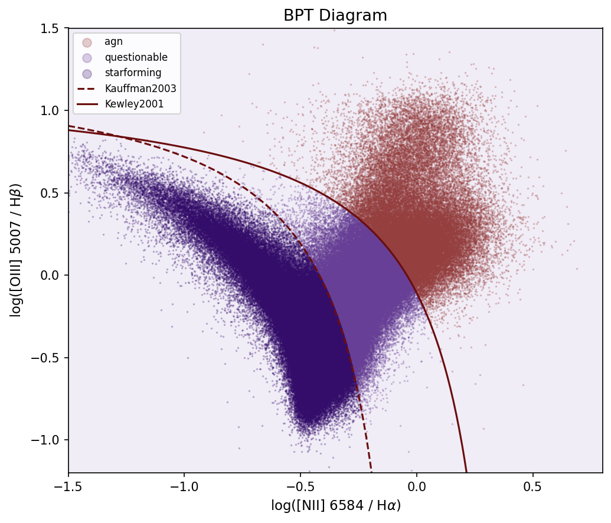
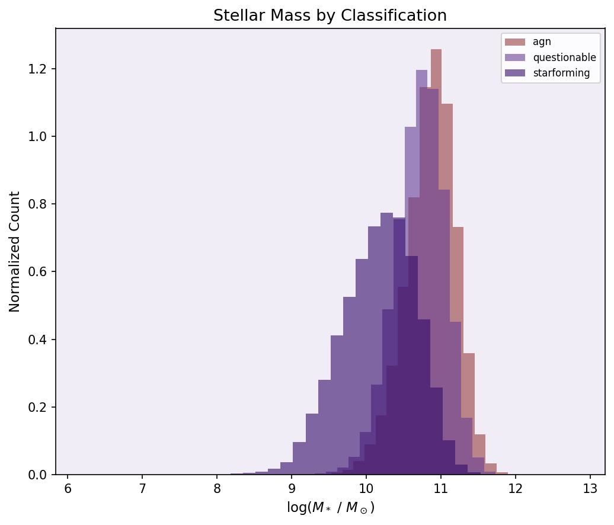
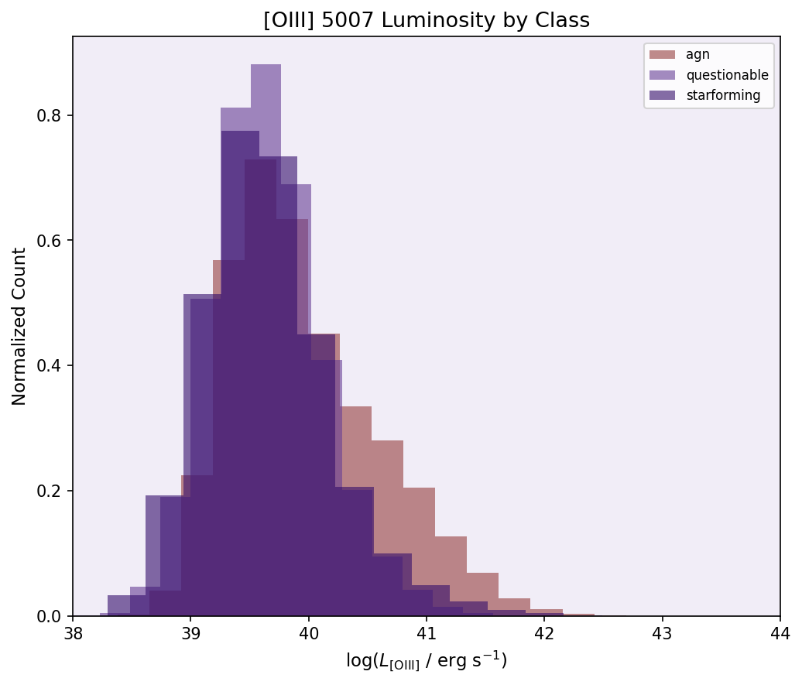

# A-Study-of-Active-Galactic-Nuclei

## Overview
This project studies the characteristics of active galactic nuclei (AGN) using the SDSS DR7 MPA/JHU catalogs.
Gaalxies are classified using BPT diagrams and host galaxy properties (stellar masses, OIII luminosity) are compared across classification.

## Data
- **Source:** SDS SDR7 MPA/JHU value added catalogs of 927,552 galaxies
- **Sample Size:** 927,552 total, quality cut to 320,759 (0.04 < z < 0.2, signal noise ratio > 3)
- **Files used:**
  - `galinfo` — redshifts, coordinates
  - `galline` — emission line fluxes
  - `stellarmasses` — log stellar masses

 ## Methods
 - BPT diagram classification using [NII/Hα] vs [OII/Hβ] line rations
 - Demarcation lines from Kauffman et al. 2003 and Kewley et al. 2001
 - [OIII] 5007 luminosity calcuated using FlatLamdaCDM model (H0=70, Om0=0.3)

## Results
classification results:
| Class | Count | Fraction |
|---|---|---|
| Star-forming | 202,076 | 63.0% |
| Composite | 73,050 | 22.8% |
| AGN | 45,633 | 14.2% |

AGN fraction of full catalog: 14.23% of 927,552 galaxies

Stellar mass by classification (log M*/Msun):
| Class | Median | Mean | STD |
|---|---|---|---|
| Star-forming | 10.20 | 10.17 | 0.50 |
| Composite | 10.74 | 10.72 | 0.34 |
| AGN | 10.89 | 10.86 | 0.33 |

AGN are systematically more massive with median log M*/Msun = 10.89

[OIII] luminosity by classification (log erg/s):
| Class | Median | Mean | STD |
|---|---|---|---|
| Star-forming | 39.60 | 39.66 | 0.63 |
| Composite | 39.62 | 39.65 | 0.47 |
| AGN | 39.84 | 39.96 | 0.64 |

AGN show higher [OIII] luminosities with a tail extending past 42 log(L) erg*s-1

## References
- Kauffman et al. 2003
- Kewley et al. 2001
- Juneau et al. 2014
- Veilleux & Osterbrock 1986
- Baldwin, Phillips, & Terlevich 1981
- Kaschinski & Ercolano 2013
